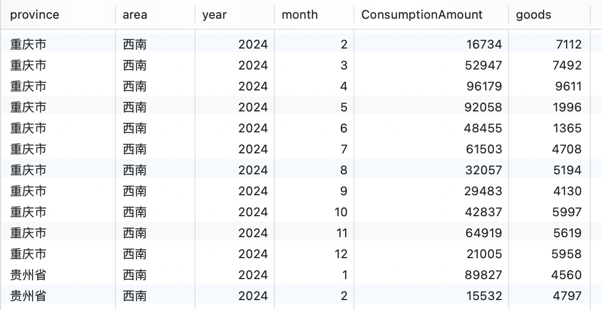

# 重庆高职大数据比赛 数据可视化接口模拟

## 环境搭建

以下是所需要东西

1. `mysql` 版本 8.0
2. `node.js` 不要太低就行
3. `python` python3应该都可以

安装 `node.js` 和 `python` 的依赖包
```bash
npm i
pip install -r requirements.txt
```

## 配置文件
找到目录下的`config.yml`文件，根据自己的环境配置一下。
```yml
# 数据库配置
mysql:
  port: 3306  # 端口
  user: "root"  # 用户名
  password: "123456"  # 密码
  adress: "127.0.0.1" # 地址
  dataBase: "demo"  # 数据库名
  dataSheet: "city" # 数据表

# 生成数据范围
data:
  startYear: 2012 # 最小年份
  endYear: 2024 # 最大年份

# 服务器配置
server:
  port: 8888  # 端口
  path: "/city" # 访问路径
  cross: false # 是否开启跨域
```

## 导入数据
配置好`config.yml`文件后，执行`数据生成.py`文件，即可。\
**数据库需要自己创建**,数据表执行python代码后，会自动创建的
```python
python3 数据生成.py
```
### 表结构
| 字段 | 中文 | 类型 |
| :-----| ----: | :----: |
| province | 省份 | 字符串 |
| area | 地区 | 字符串 |
| year | 年 | 整形 |
| month | 月 | 整形 |
| ConsumptionAmount | 消费额 | 整形 |
| goods | 商品量 | 整形 |



## 启动Web服务器
```bash
node app.js
```

启动成功后，可以运行`test.py`文件简单测试一下。
